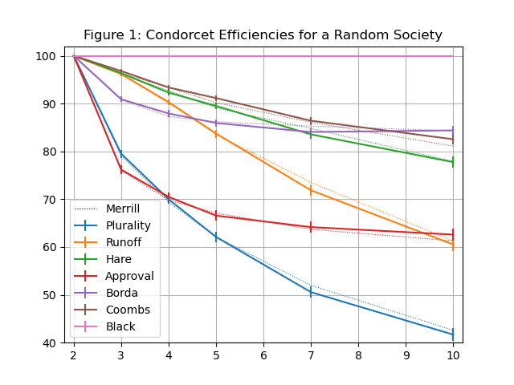

# Election Simulator 3000
[](https://circleci.com/gh/endolith/elsim)
[](https://github.com/endolith/elsim/actions)

This is a library of functions for simulating thousands of elections held using different [voting methods](https://en.wikipedia.org/wiki/Electoral_system) ([Borda count](https://en.wikipedia.org/wiki/Borda_count), [Approval voting](https://en.wikipedia.org/wiki/Approval_voting), etc.) under different voter models ([impartial culture](https://en.wikipedia.org/wiki/Impartial_culture), [spatial model](https://en.wikipedia.org/wiki/Spatial_model_of_voting), etc.)

For example, it can be used to reproduce Figure 1 from [Merrill 1984](https://www.jstor.org/stable/2110786):



Or the table of Effectiveness from [Weber 1977](https://elischolar.library.yale.edu/cowles-discussion-paper-series/732/):

|      | Standard | Vote-for-half | Borda |
| ---: | -------: | ------------: | ----: |
|    2 |    81.37 |         81.71 | 81.41 |
|    3 |    75.10 |         75.00 | 86.53 |
|    4 |    69.90 |         79.92 | 89.47 |
|    5 |    65.02 |         79.09 | 91.34 |
|    6 |    61.08 |         81.20 | 92.61 |
|   10 |    50.78 |         82.94 | 95.35 |
|  255 |    12.78 |         86.37 | 99.80 |

## Goals

- Fast (~25,000 elections per second on Core i7-9750H)
- Flexible
- Well-documented, easily-used and improved upon by other people
- Well-tested and bug-free
- Able to reproduce peer-reviewed research

## Requirements
See `requirements.txt`.  As of this README, it includes  [`numpy`](https://numpy.org/) and [`scipy`](https://www.scipy.org/)for the simulations, [`tabulate`](https://github.com/astanin/python-tabulate) for printing example tables, [`joblib`](https://joblib.readthedocs.io/en/latest/) for parallelizing extreme examples, and  [`pytest`](https://docs.pytest.org/en/latest/), [`hypothesis`](https://hypothesis.readthedocs.io/en/latest/), and [`pytest-cov`](https://github.com/pytest-dev/pytest-cov) for running the tests.  All should be installable through `conda`.

Optionally, `elsim` can use [`numba`](http://numba.pydata.org/) for speed.  If not available, the code will still run, just more slowly.

## Installation
One possibility is to install with pip:

    pip install git+https://github.com/endolith/elsim.git

## Documentation
Currently just the docstrings of the submodules and functions themselves, in [`numpydoc` format](https://numpydoc.readthedocs.io/en/latest/format.html).

## Usage
Specify an election with three candidates (0, 1, 2), where two voters rank candidates 0 > 2 > 1, two voters rank candidates 1 > 2 > 0, and one ranks candidates 2 > 0 > 1:

```python
>>> election = [[0, 2, 1],
                [0, 2, 1],
                [1, 2, 0],
                [1, 2, 0],
                [2, 0, 1]]
```

Calculate the winner using Black's method:

```python
>>> from elsim.methods import black
>>> black(election)
2
```

Candidate 2 is the Condorcet winner, and wins under Black's method.

See [/examples](/examples) folder for more on what it can do, such as reproductions of previous research.

## Submodules

Originally, the functions in submodules were meant to be chained together in a simple flow: 

1. A function from `elsim.elections` takes parameters as input (number of candidates, number of voters, dispersion in spatial model, etc.) and produces an array of utilities (each voter's appraisal of each candidate).  
2. Then a function from `elsim.strategies` converts each voter's utilities into a ballot.  
3. Then a function from `elsim.methods` counts the collection of ballots and chooses a winner.

```mermaid
flowchart LR
    Parameters -- Election --> Utilities
    Utilities -- Strategy --> Ballots
    Ballots -- Method --> Winner
```

However, while implementing many various scenarios, it has become more complicated.  Some functions produce intermediate results, while others skip over multiple steps.  I'm no longer sure the best way to organize these functions into submodules.  Here is a diagram showing the flow of every function currently in the submodules:

```mermaid
%%{ init: { 'flowchart': { 'curve': 'monotoneX' } } }%%
flowchart LR
    %% elections.py
    Parameters -- <code>random_utilities</code> --> Utilities
    Parameters -- <code>impartial_culture</code> --> Ballots
    Parameters -- <code>normal_electorate</code> --> Positions
    Positions -- <code>normed_dist_utilities</code> --> Utilities

    %% strategies.py
    Utilities -- <code>honest_rankings</code> --> Ballots
    Utilities -- <code>honest_normed_scores</code> --> Ballots
    Utilities -- <code>approval_optimal</code> --> Ballots
    Utilities -- <code>vote_for_k</code> --> Ballots

    %% approval.py
    Ballots -- <code>approval</code> --> Winner
    Ballots -- <code>combined_approval</code> --> Winner

    %% black.py
    Ballots -- <code>black</code> --> Winner

    %% borda.py
    Ballots -- <code>borda</code> --> Winner

    %% condorcet.py
    Ballots -- <code>ranked_election_to_matrix</code> --> Matrix
    Matrix -- <code>condorcet_from_matrix</code> --> Winner
    Ballots -- <code>condorcet</code> --> Winner

    %% coombs.py
    Ballots -- <code>coombs</code> --> Winner

    %% fptp.py
    Ballots -- <code>fptp</code> --> Winner

    %% irv.py
    Ballots -- <code>irv</code> --> Winner

    %% runoff.py
    Ballots -- <code>runoff</code> --> Winner

    %% score.py
    Ballots -- <code>score</code> --> Winner

    %% star.py
    Ballots -- <code>matrix_from_scores</code> --> Matrix
    Ballots -- <code>star</code> --> Winner

    %% utility_winner.py
    Utilities -- <code>utility_winner</code> --> Winner
```

(And the `Ballots` block contains multiple different formats, so it could be shown in a more complex way than this.)

## Tests
Tests can be run by installing the testing dependencies and then running `pytest` in the project folder.

## Bugs / Requests
File issues on the [Github issue tracker](https://github.com/endolith/elsim/issues).

## Similar projects

### Election simulators

- 1D:
  - http://zesty.ca/voting/voteline/ (Flash, 5 candidates, normal/uniform/bimodal distribution)
  - https://demonstrations.wolfram.com/ComparingVotingSystemsForANormalDistributionOfVoters/
- 2D:
  - http://bolson.org/voting/sim_one_seat/www/spacegraph.html
  - http://zesty.ca/voting/sim/
  - http://rangevoting.org/IEVS/Pictures.html
- ND:
  - https://github.com/electology/vse-sim

### Voting system implementations

* [See Electowiki](https://electowiki.org/wiki/Voting_links#Election_calculators)
